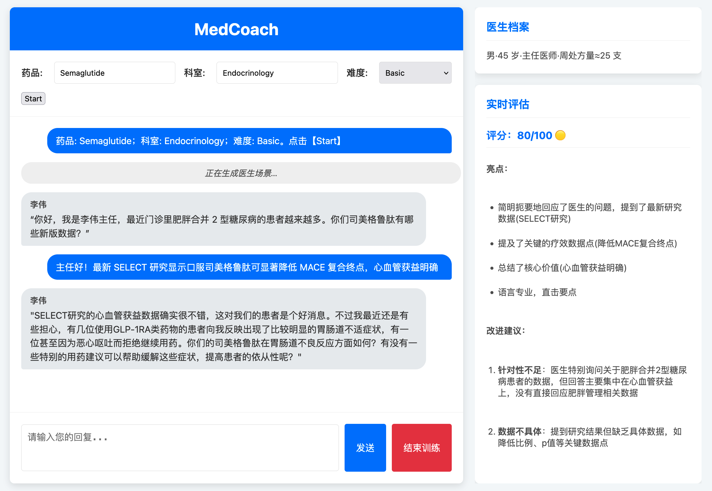

# Med Coach

Med Coach 是一款交互式培训工具，旨在帮助医药代表提升与医生的沟通技巧和产品知识。它通过模拟真实的医患对话场景，并提供实时的反馈和评估，助力医药代表在真实的临床推广中更加自信和专业。



## 功能特性

*   **模拟对话场景**: 根据选择的药品、科室和难度，生成不同的医生角色和对话情景。
*   **实时评估与反馈**: 教练（AI）会对医药代表的回复进行实时评估，指出优点和需要改进的地方。
*   **动态医生档案**: 为每个场景生成一个虚拟的医生档案，帮助代表了解沟通对象。
*   **个性化难度选择**: 提供基础、中级、高级等不同难度，适应不同水平的代表。
*   **训练总结报告**: 训练结束后，提供一份详细的总结报告，回顾整体表现和关键学习点。
*   **语音输入功能**: 支持通过麦克风录音，使用 Amazon Transcribe 自动将语音转换为文字，提供更自然的交互体验。

## 先决条件

在开始之前，请确保您的系统已安装以下软件：

*   Python (3.10 或更高版本)
*   pip (Python 包安装器)
*   一个现代的网页浏览器 (如 Chrome, Firefox, Safari, Edge)

## 安装与启动

按照以下步骤在本地安装和运行 PharmaRep Coach：

1.  **克隆或下载仓库** (如果您是通过git管理项目)
    ```bash
    # git clone https://github.com/AutoJunjie/medical-rep-coach.git
    # cd medical-rep-coach
    ```

2.  **创建并激活虚拟环境** (推荐):
    ```bash
    python -m venv venv
    # Windows
    venv\Scripts\activate
    # macOS/Linux
    source venv/bin/activate
    ```

3.  **安装依赖**:
    进入项目根目录 (包含 `requirements.txt` 文件的目录)，然后运行：
    ```bash
    pip install -r requirements.txt
    ```

4.  **配置环境变量** (可选，用于语音转录功能):
    复制 `.env.example` 文件并重命名为 `.env`：
    ```bash
    cp .env.example .env
    ```
    编辑 `.env` 文件，填入您的 AWS 凭证（如需使用语音转录功能）：
    ```
    AWS_ACCESS_KEY_ID="your-access-key-id"
    AWS_SECRET_ACCESS_KEY="your-secret-access-key"
    AWS_REGION="us-east-1"  # 或您偏好的区域
    TRANSCRIBE_LANGUAGE_CODE="zh-CN"  # 或 "en-US" 用于英文
    ```
    **注意**: 如不配置 AWS 凭证，应用仍可正常使用，但语音转录功能将不可用。

5.  **启动后端服务**:
    在项目根目录下运行：
    ```bash
    python main.py
    ```
    启动成功后，您应该会在终端看到类似 `* Running on http://127.0.0.1:5000` 的信息。这表示后端服务已在本地的5000端口上运行。

6.  **打开前端页面**:
    ```bash
    python python -m http.server 8080
    ```
    启动成功后浏览器打开http://127.0.0.1:8080 开启前端

## 如何使用

1.  **配置训练参数**:
    *   **药品 (Drug Name)**: 输入您希望练习推广的药品名称。
    *   **科室 (Department)**: 输入目标科室。
    *   **难度 (Difficulty)**: 选择训练的难度级别 (Basic, Intermediate, Advanced)。
2.  **开始训练 (Start)**: 点击【Start】按钮。系统会根据您的配置加载医生档案，并开始模拟对话。
3.  **与医生对话**:
    *   医生会首先提出问题或场景。
    *   在下方的文本框中输入您的回复，或点击麦克风按钮 (🎤) 使用语音输入。
    *   **语音输入**: 点击麦克风按钮开始录音，再次点击停止录音。系统会自动将语音转换为文字并填充到输入框中，您可以检查修改后再发送。
    *   点击【发送 (Send)】按钮或按 `Enter` 键发送您的回复。
4.  **查看实时评估**:
    *   您的回复发送后，右侧的"实时评估"区域会显示教练对您回复的评估和建议。
    *   左侧的聊天框会显示您和医生的对话历史。
5.  **结束训练 (End Training)**:
    *   当您希望结束当前的训练会话时，点击【结束训练】按钮。
    *   系统会生成一份本次训练的总结报告，显示在聊天窗口下方。

## 注意事项

*   确保后端服务 (`main.py`) 在您使用 `index.html` 时保持运行状态。
*   实时评估和医生回复由后端AI模型生成，可能需要几秒钟的时间。
*   语音转录功能需要配置 AWS 凭证，首次使用时浏览器会请求麦克风权限。
*   语音转录使用 Amazon Transcribe 服务，可能会产生 AWS 费用，请查看 AWS 定价详情。

希望这份指南能帮助您快速开始使用 Med Coach！